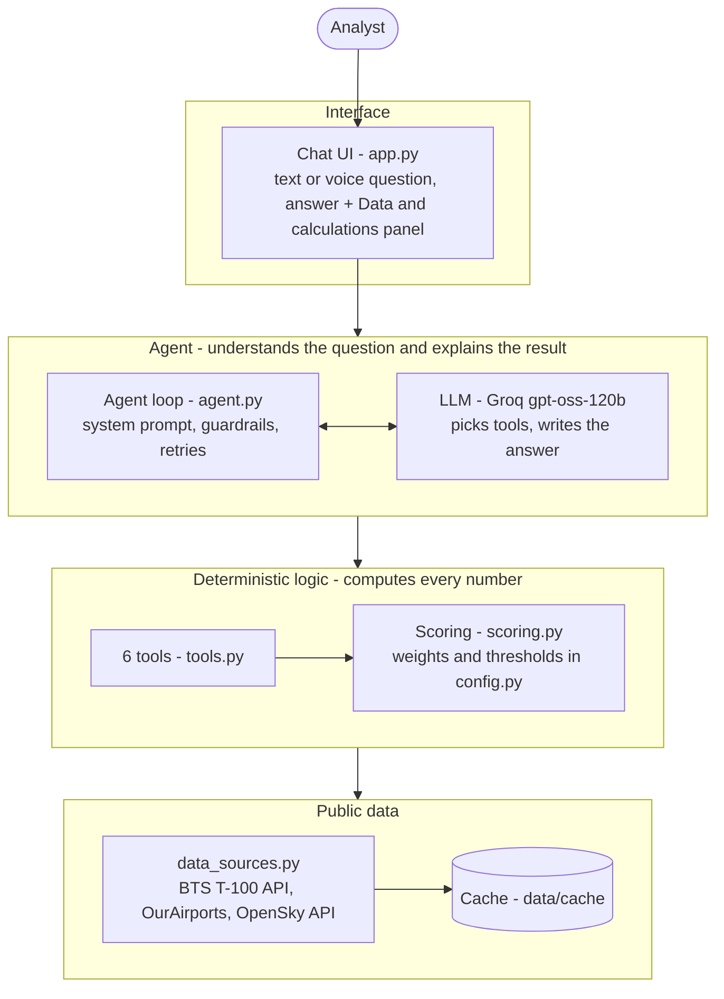
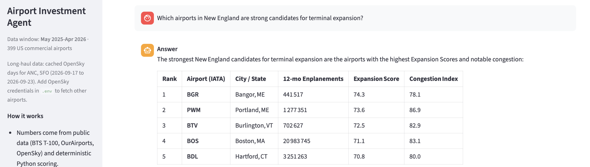
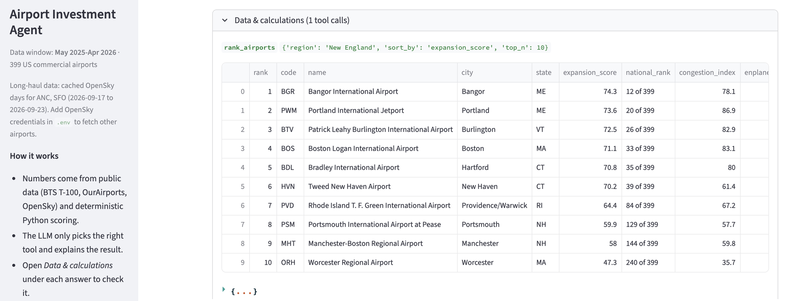

# Airport Investment Intelligence Agent

An AI agent that helps analysts identify US airports where renovations would be most profitable, based on increased flight and passenger capacity.
All numbers come from public data and deterministic Python scoring. The LLM only chooses which tool to run and explains the result.

- [docs/DESIGN.md](docs/DESIGN.md): scoring methodology, tradeoffs, where AI is used
- [docs/SAMPLES.md](docs/SAMPLES.md): real answers to the example questions, including a follow-up

## Architecture



1. The analyst asks a question in the chat.
2. The agent sends it to the LLM with the list of available tools.
3. The LLM picks a tool (for example `analyze_unmet_demand("SFO")`).
4. The tool computes the numbers in Python from cached public data.
5. The LLM writes the answer from those numbers, with assumptions and uncertainty.
6. The UI shows the answer plus a "Data & calculations" panel with every tool call.

## Screenshots

An answer to one of the example questions:



The "Data & calculations" panel under the same answer: the exact tool call and the numbers the code returned.



## Quick start (macOS / Linux, Python 3.9+)

```bash
python3 -m venv .venv && source .venv/bin/activate
pip install -r requirements.txt
cp .env.example .env          # add a free Groq API key to LLM_API_KEY
streamlit run app.py          # opens http://localhost:8501
```

The data cache is included in the repo, so no download is needed. To refresh it: `python data_sources.py --refresh`.

Other commands:
- `python cli.py`: chat in the terminal (`--samples` runs the example questions)
- `python tools.py`: run the scoring tools directly, without the LLM
- `python -m pytest -q`: unit tests for the scoring logic

## Example questions

- Which airports in New England are strong candidates for terminal expansion?
- Compare LA and Santa Ana airport congestion levels.
- What is the percentage of long haul flights out of Anchorage airport?
- What is the unmet flight demand in SFO airport and why?
- Follow-ups: "What if long-haul is 3,000 miles?", "Show SFO's monthly trend", "Only airports above 1M passengers".

Questions can also be asked by voice: record in the sidebar ("Ask by voice"). The recording is transcribed with
Groq Whisper and handled like a typed question; answers stay as text.

## Project layout

| File | Role |
|---|---|
| `app.py` | Streamlit chat UI with a "Data & calculations" panel under each answer |
| `agent.py` | LLM loop and system prompt (rules: no invented numbers, state assumptions) |
| `tools.py` | The 6 functions the LLM can call |
| `scoring.py` | KPIs, Expansion Score, Congestion Index, unmet demand, route distance mix |
| `config.py` | All weights, thresholds and regions in one place |
| `data_sources.py` | Downloads and caches BTS T-100, OurAirports and OpenSky data |
| `voice.py` | Voice input: speech-to-text with Groq Whisper (bonus) |
| `cli.py` | Terminal chat and sample runner |
| `tests/` | Unit tests (scoring on synthetic data, voice with a fake client) |

## Optional: new OpenSky data

Long-haul questions use observed flights from OpenSky Network. Cached days for Anchorage (ANC) and San Francisco (SFO) are included.
To fetch new days, create a free OpenSky account, add an API client, and put its id and secret in `.env`.
