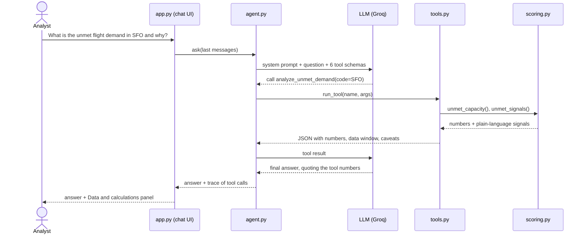

# Design - Airport Investment Intelligence Agent

## 1. Problem framing
An airport renovation pays off when it unlocks traffic that is **already there or clearly coming**:
lots of passengers, flights that are full, demand growing faster than the seats offered, and an airfield
that is busy. The agent turns that idea into transparent KPIs, ranks airports on them, and lets an analyst
interrogate the result in chat.

## 2. Architecture
The high-level view is in the [README](../README.md#architecture). Below is the flow of one question,
showing where the numbers are computed and where the guardrails sit.

Guardrails in this flow:
- **System prompt:** every number must come from a tool result; no own arithmetic; missing data is not zero;
  every answer ends with assumptions and uncertainty.
- **Tools:** return full totals (so the LLM has nothing to calculate) and an explicit `NO_DATA` status.
- **UI:** the trace of every tool call is shown under the answer, so an analyst can check each number.
- **Rate limits:** the SDK retries automatically, then a smaller fallback model answers (the answer says so).

## 3. Data sources
| Source | What we use | Notes |
|---|---|---|
| BTS T-100 Segment Summary by Origin Airport (data.bts.gov API) | Monthly enplaned passengers, seats, departures, avg flight distance, domestic vs total | Official DOT data, all US airports, ~5-month lag |
| BTS T-100 (2019) | Pre-pandemic passenger baseline | Recovery context |
| OurAirports | State, coordinates, runway count (open, ≥3,000 ft) | Community-maintained |
| OpenSky Network | Observed departures with destination airport | Sample-based ADS-B coverage; used for long-haul share |

## 4. Scoring methodology (deterministic)
Window: last 12 months of BTS data vs the prior 12 months (removes seasonality).
Universe: US airports with ≥ 10,000 yearly enplanements (FAA "primary" threshold).

| KPI | Formula | Why it matters |
|---|---|---|
| Scale | 12-month enplaned passengers | Size of the revenue pool |
| Load factor | passengers / seats | Full flights = demand pressing on capacity |
| Passenger growth | pax(12m) / pax(prior 12m) − 1 | Momentum |
| Supply gap | passenger growth − seat growth | Demand outpacing what airlines supply |
| Runway strain | 2 × departures / 365 / runways | Airfield busyness (proxy for congestion) |
| Peak-month load factor | max monthly LF in window | Seasonal crunch |

**Expansion Score (0-100)** = weighted average of national percentile ranks:
scale 20%, load factor 25%, passenger growth 20%, supply gap 20%, runway strain 15%.
Percentiles make different units comparable and keep one outlier from dominating.
Scale is deliberately only 20%: the goal is to surface *asymmetric* opportunities (full, fast-growing,
supply-constrained airports), not just re-list the largest hubs. E.g. in New England, Bangor (BGR) ranks above
Boston (BOS). Analysts who care only about large hubs can filter (`min_passengers`, supported in chat) or change
the weights in `config.py`.

**Congestion Index (0-100)** = average percentile of load factor, peak-month load factor, runway strain.

**Unmet demand** = seats needed to bring the 12-month load factor down to 80%
(`passengers / 0.80 − seats`), converted to daily flights with the airport's average seats per departure.
Explained by rule-based signals, relative to all US airports so thresholds stay calibrated: load factor,
peak-month load factor and runway strain in the national top 20%; passenger growth vs seat growth; traffic vs 2019.

**Long-haul share** = share of observed airline departures (OpenSky, last 7 days) whose great-circle distance
is ≥ 2,500 miles (~4,000 km). The threshold is a parameter the user can change in chat.

## 5. Where and how AI is used
- **LLM (Groq, openai/gpt-oss-120b by default)**: understands the question, resolves entities ("LA" → LAX),
  chooses tools and arguments, and writes the explanation with assumptions.
- **Not AI**: all numbers, rankings and scores (Python, unit-tested). The system prompt forbids stating any
  number that is not in a tool result, and requires an "Assumptions & uncertainty" section.
- Follow-ups: the chat history is sent back to the LLM, which can reuse earlier numbers or call tools again.
- **Speech-to-text (Groq Whisper, bonus)**: a question recorded in the sidebar is transcribed and then handled
  exactly like a typed question (`voice.py`).

## 6. Key tradeoffs
| Choice | Gain | Cost |
|---|---|---|
| Proxies (LF, supply gap, runway strain) instead of terminal/gate capacity | Uses free, national, consistent data | No direct terminal capacity or cost data |
| Percentile scoring with fixed weights | Transparent, explainable, testable | Weights are judgment calls (all in `config.py`) |
| BTS T-100 monthly | Official and complete | ~5-month lag; not real-time |
| OpenSky sample for routes | Only free per-flight destination source | Coverage gaps; includes cargo; 7-day sample |
| Cached data in repo | Runs offline, reproducible demo | Needs `--refresh` to update |
| Text-only history to LLM | Fits free-tier token limits | LLM re-calls tools for detailed follow-ups |
| Voice = speech input only | Reuses the whole pipeline; tables and numbers read better than they sound | No spoken answers, no real-time voice conversation |

## 7. Assumptions, uncertainty, scope
- Enplanements (departing passengers) represent airport demand; connecting vs local passengers are not separated.
- Flown passengers only: travelers who could not get a seat are invisible → unmet demand is a proxy.
- Runway counts from OurAirports; movements include only BTS-reporting carriers (no general aviation).
- Out of scope: construction cost, airport finances, fares, gate counts, local regulation.
- Voice scope: the bonus is read as "ask by voice"; answers stay as text (they contain tables).
- Free LLM tier (Groq, 8K tokens/min): the SDK retries on rate limits, then falls back to a smaller model
  (answer is labelled). Answers can take 10-30 s when several questions are asked back to back.

## 8. Verification
- Unit tests (`pytest`) on synthetic data for KPI math, ranking determinism, unmet demand, distance bands.
- Sanity check against known airport sizes: 12-month enplanements SFO 26.6M, LAX 36.6M, BOS 21.0M
  (≈ half of each airport's total passengers, as expected for departing-only counts); LAX ≈ 371 movements per runway per day.
- Sample answers (`docs/SAMPLES.md`) audited number-by-number against tool output.
- Guardrails added after testing: the LLM first reported "0% long-haul" when OpenSky data was missing, and once
  invented seat totals. Fixes: tools return explicit `NO_DATA` and full totals; the prompt forbids own arithmetic.
  Residual risk: the LLM may still paraphrase a derived figure; the "Data & calculations" panel under every
  answer lets the analyst verify.

## 9. Next steps (if continued)
Delay data (BTS on-time / FAA) in the Congestion Index · FAA enplanement & capacity reports ·
weight tuning with analysts · spoken answers · scenario analysis (e.g. "what if seats grow 10%") ·
an automated check that every number in an answer appears in the tool output.
